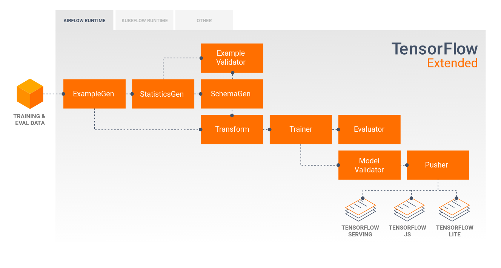
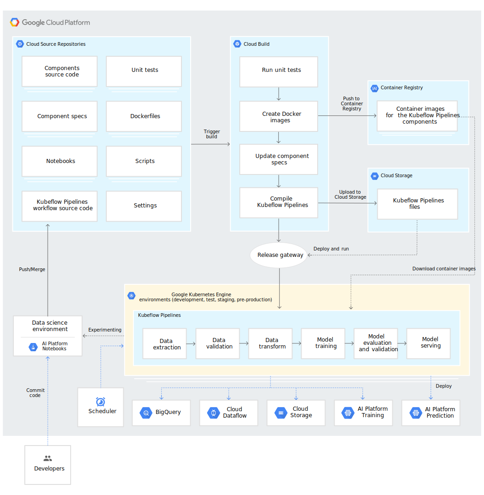

# TFX Pipeline


A Tensorflow Extended framework is designed to preprocess raw data from bigquery, trained using deep learning, where the model will be evaluated against previous blessing versions and automatically deployed to a production ready serving platform.



* TFX is a production ready ML pipeline built using TFX library components

* This framework is utilizes GCP AI Platform pipelines and orchestrated with Kubeflow on Kubernetes clusters 

* It is also equipped with Dataflow support for batch data processing, AI Platform jobs for training, and model blessing evaluation with automatic deployment to AI Platform Predictions.

* CICD is implemented using github-actions to update the kubeflow pipeline with the latest codebase, and CT is setup to continuously train the model on new data on a weekly basis.

## Dataset

TODO: Add dataset description

## Installation

In addition to installing the appropriate python packages, skaffold will be used here as well. Skaffold is required by TFX pipeline to build the containers required by the kubeflow orchestrator. 

```shell
git clone git@github.com:AaronGrainer/tfx-pipeline.git

conda create -n [ENV_NAME] python=3.7

conda activate [ENV_NAME]

pip install -r requirements.txt

make install-skaffold
```

## Environment Variables

1. Create a new .env file using the .env_reference file as reference. Populate the .env file with the desired app settings. This file serves to provide all the environment variables necessary for deploying the app.

* Note: Some of the variables are only obtainable after some of the steps below.

## Local Run

The TFX pipeline can be run locally using Apache Beam, ideal for development before pushing to the heavylifting kubernetes clusters. 

To run locally

```shell
make run-local
```

## Setting up AI Platform Pipeline

AI Platform pipeline provides an abstraction layer over the whole workflow pipeline, it will setup kubeflow on the kubernetes clusters for us. 

While its easier for AI Platform pipeline to create the K8 clusters for us with the appropriate resources and permissions, it is much cheaper to create the K8 clusteres with preemptible machines ourselves.

To create the service-accounts and kubernetes clusters, run

```shell
make create-service-account
make create-cluster
```

Now, visit [AI Platform Pipelines](https://console.cloud.google.com/ai-platform/pipelines) and create a new instance with the previously created K8 cluster.

After the new instance has been created, update the `ENDPOINT` field in the .env file with the URL of the Kubeflow instance, the endpoint starts after the `https://` and ends with `.googleusercontent.com`

## Creating and Running TFX Pipeline



On the first run, create and run the pipeline using the commands below, a link will be provided to check the status of the pipeline.

```shell
make tfx-create-pipeline
make tfx-run
```

If any changes are made to the pipeline code, the Kubeflow orchestrator can be updated and run

```shell
make tfx-update-pipeline
make tfx-run
```

## CICD with Github-actions

A github workflows yaml file is also provided to automatically update the TFX pipeline in Kubeflow when pushed to the master branch, this can be tweeked for any intended behaviour.

Some github secrets must be provided for github actions to access GCP resources.

* First create a service account with enough permission, or with editor privilege, and update the `SERVICE_ACCOUNT_GITHUB` field in the .env file. Then generate the key.json file with

```shell
make create-service-account-key
```

* Visit the github settings -> secrets page and add the following secrets: `PROJECT_ID`, `SA_EMAIL` and `SA_KEY`.

Now everytime the codebase changes, the github-actions will launch a new workflow to update the TFX pipeline in Kubeflow.

## Continuous Training

To configure and enable continous training on the Kubeflow pipeline. 

* Visit the kubeflow endpoint url -> experiments and create a new recurring run.

* This will schedule the pipeline to periodically ingest raw data from bigquery, transform, train, evaluate and deploy to AI Platform if the model meets the evaluation requirements.

* Continuous training allows the deployed model to avoid skews and drifts resulting from changing data behaviour and keep the model up-to-date, capturing the minute details and capitalizing on accurate predictions matching semi real-time changes. 

* For example the data source (bigquery) can be updated with recorded data in real-time and the model will retrain itself weekly and only deploy the newest model if it meets certain evaluation standards. 


